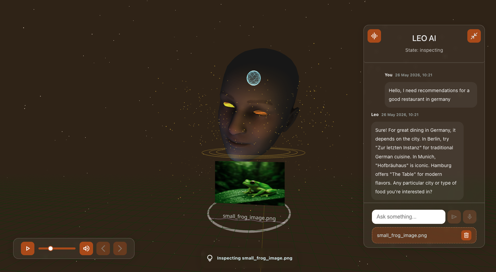
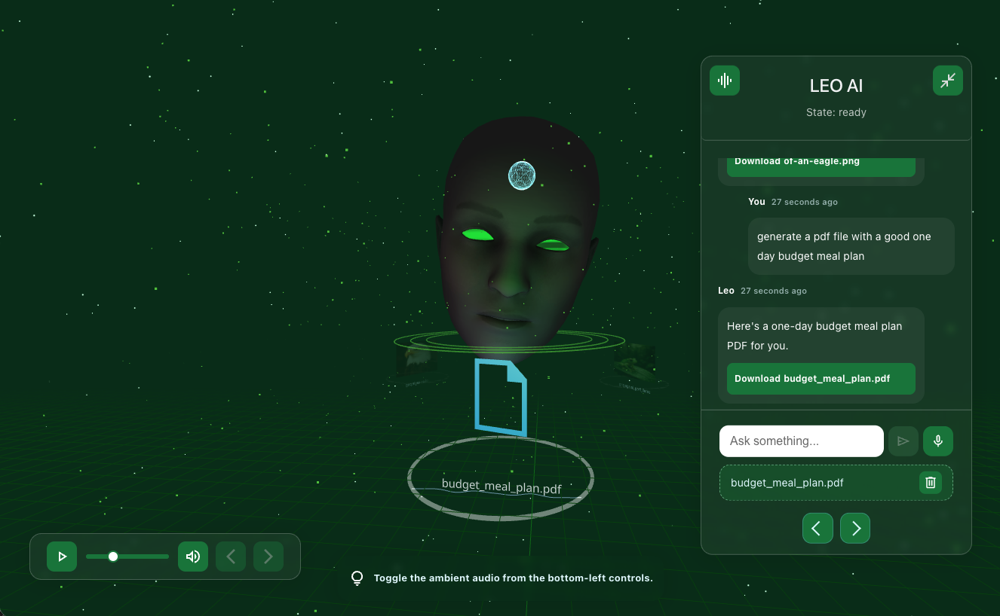
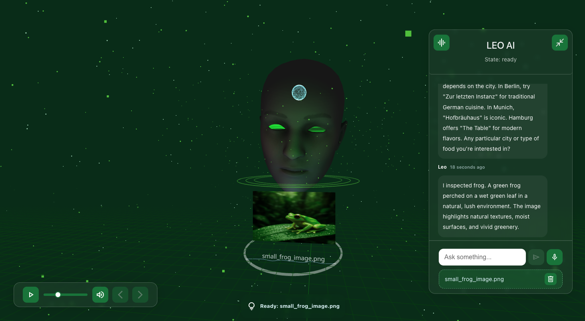
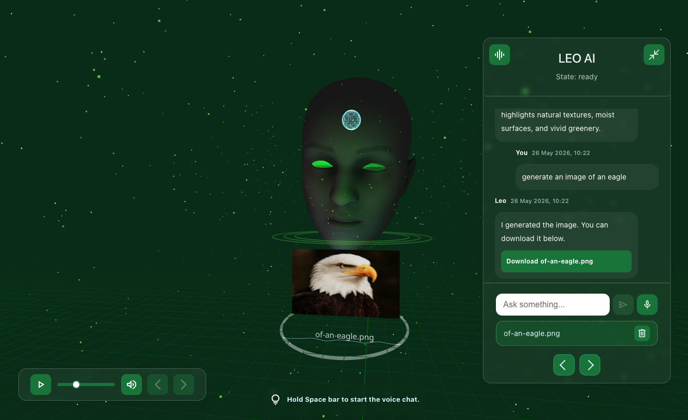
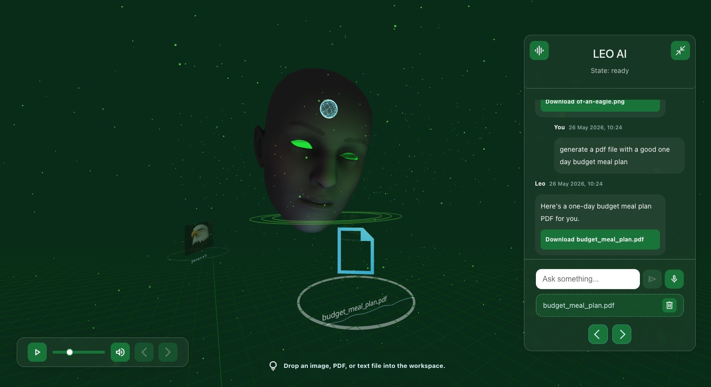
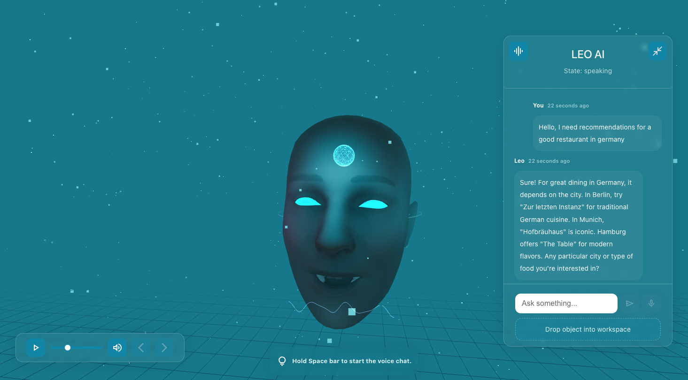

# LEO AI

[](https://app.netlify.com/projects/leoai-app/deploys)

A real-time AI avatar built with Three.js, React, and OpenAI.

## 🎯 Vision

LEO AI is a real-time conversational AI avatar built with React, Three.js, and OpenAI. It combines voice interaction, 3D facial animation, spatial file analysis, downloadable AI-generated artifacts, and a futuristic workspace interface.

Inspired by future human-computer interaction systems.

## ✨ Features

- Voice chat with speech-to-text and text-to-speech
- Text chat with session-based conversation memory
- Real-time 3D avatar rendering with facial expressions and gestures
- File/object upload analysis for images, PDFs, text, code, and markdown
- AI-generated downloadable files, PDFs, and images
- Spatial workspace display for generated or uploaded content
- Demo-token access mode for production deployments
- Audio-reactive and futuristic visual interface
- Interactive workspace for file downloads and context (WIP)

## Demo

Live demo: https://leoai-app.netlify.app/

## Preview













## 🧱 Tech Stack

**Frontend:**

- React
- TypeScript
- Vite
- Three.js / React Three Fiber
- Zustand
- Sass

**Backend:**

- Node.js
- Express
- TypeScript
- OpenAI API
- Multer
- PDFKit

## 🚀 Getting Started

### 1. Clone

```bash
git clone https://github.com/dryra/leo-ai.git
cd leo-ai
```

### 2. Install frontend dependencies

```bash
cd client
npm install
```

### 3. Install backend dependencies

```bash
cd server
npm install
```

### 4. Create `.env`

Create server/.env:

```bash
PORT=3001
OPENAI_API_KEY=your_openai_api_key_here
DEMO_TOKEN=your_demo_token_here
CLIENT_URL=http://localhost:5173
CONTACT_EMAIL=your_email@example.com
CONTACT_LINKEDIN_URL=https://www.linkedin.com/in/your-profile
```

Create client/.env:

```bash
VITE_API_URL=http://localhost:3001
VITE_CONTACT_EMAIL=your_email@example.com
VITE_CONTACT_LINKEDIN_URL=https://www.linkedin.com/in/your-profile
```

### 5. Run frontend

```bash
npm run dev
```

### 6. Run backend

```bash
npm run dev
```

## 👨‍💻 Author

**Ahmed Drira** — Senior Software Engineer focused on frontend, XR, real-time systems, and AI-powered interactive applications.
